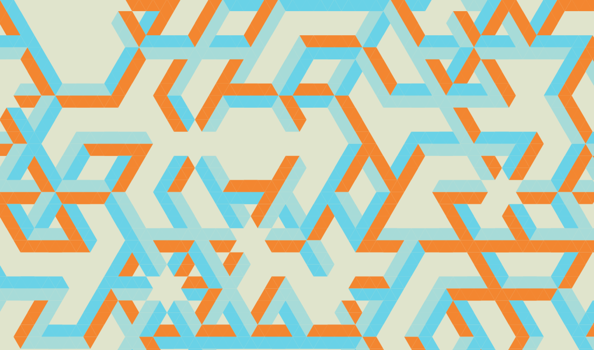
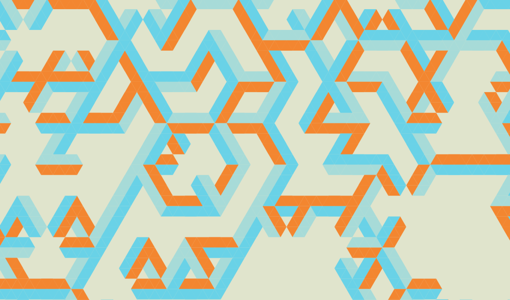
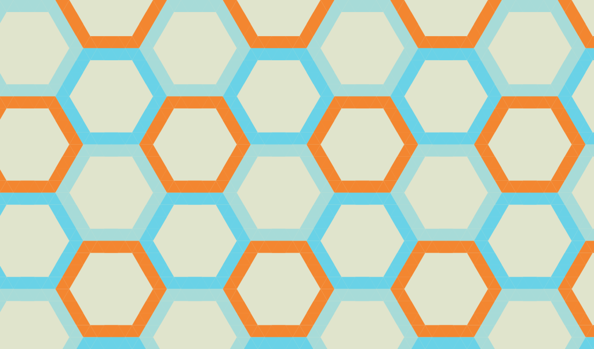
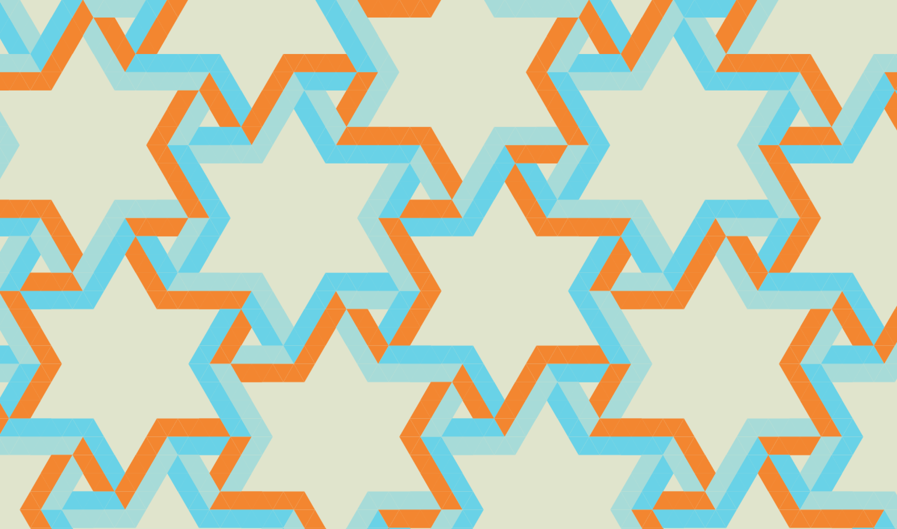
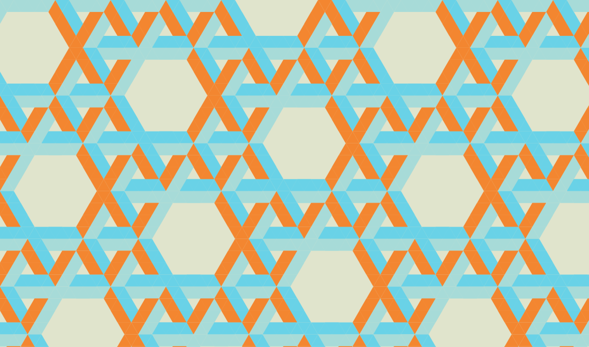
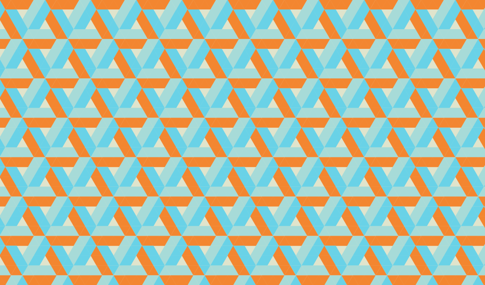
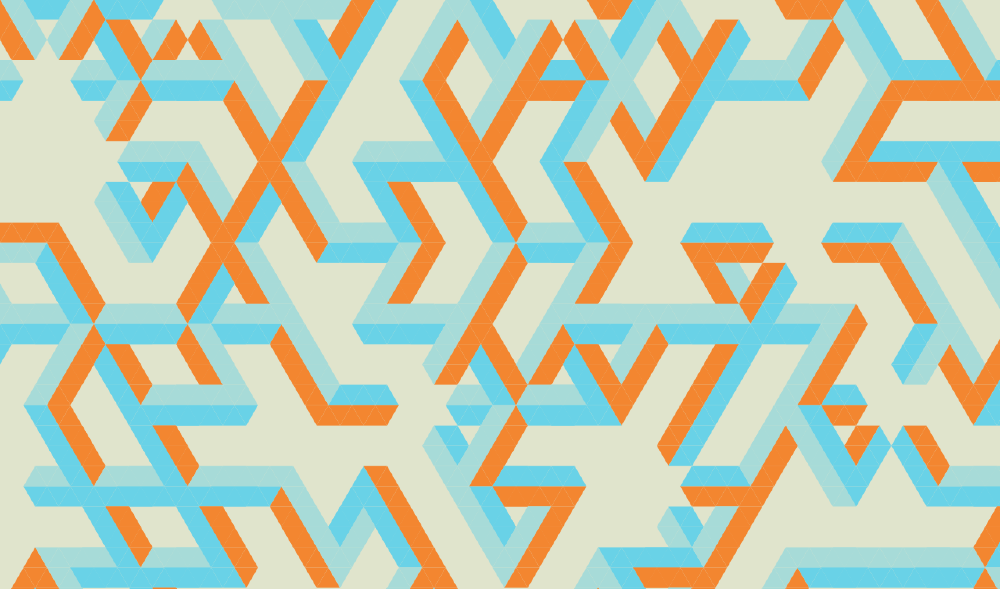
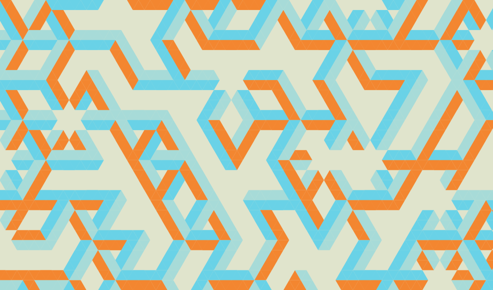
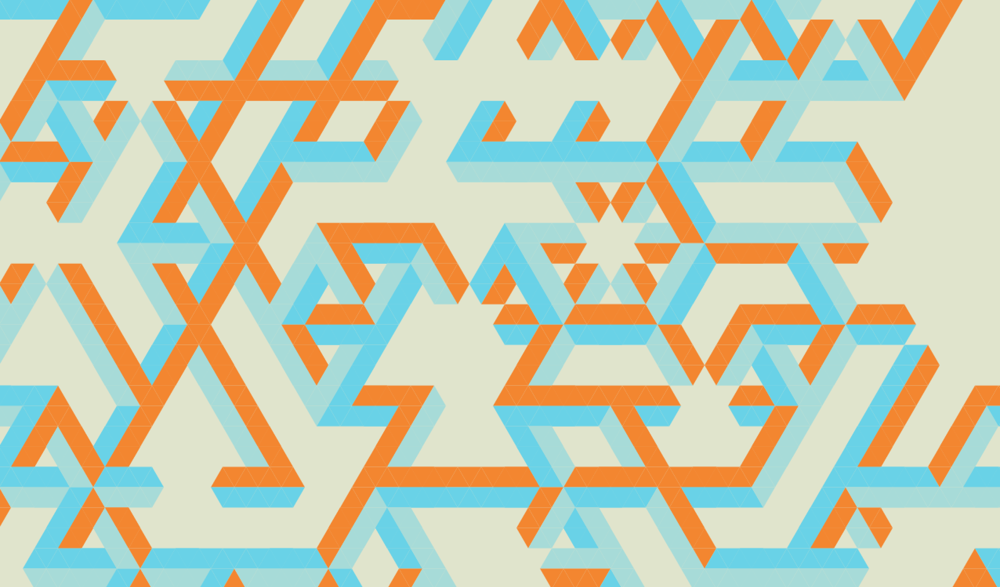
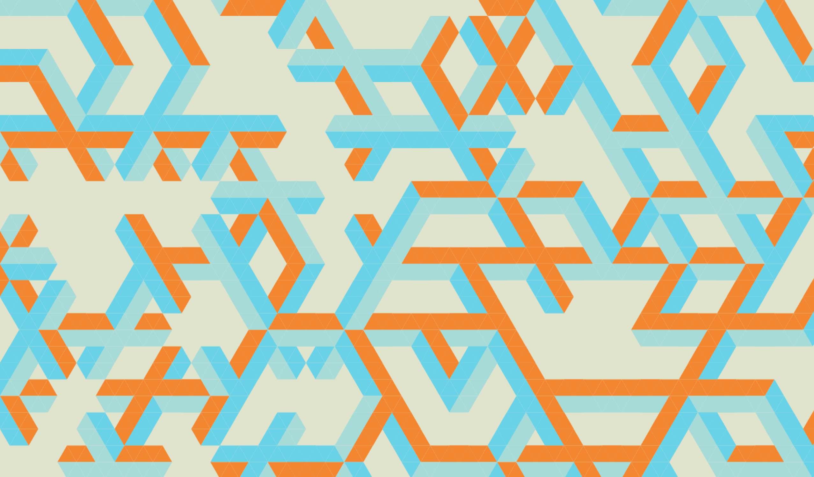

ImpossibleShapes
================

Instructions
------------
- Click the mouse button to cycle through patterns
- Press `r` to switch to random mode
- Press `p` to switch to preset mode

Unit tests
----------
- Press `t` to run unit tests

Examples
--------

